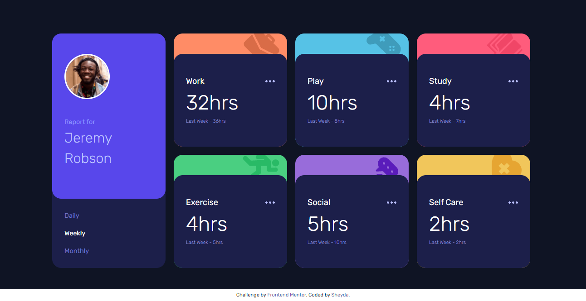
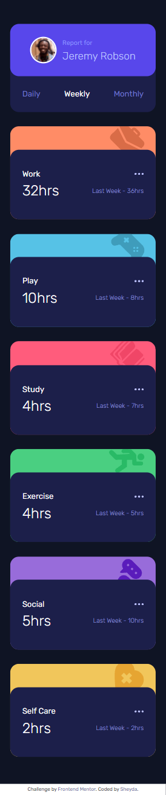

# Frontend Mentor - Time tracking dashboard solution

This is a solution to the [Time tracking dashboard challenge on Frontend Mentor](https://www.frontendmentor.io/challenges/time-tracking-dashboard-UIQ7167Jw).

## Table of contents

- [Overview](#overview)
  - [The challenge](#the-challenge)
  - [Screenshot](#screenshot)
  - [Links](#links)
  - [Built with](#built-with)
- [Author](#author)

## Overview

### The challenge

Users should be able to:

- View the optimal layout for the site depending on their device's screen size
- See hover states for all interactive elements on the page
- Switch between viewing Daily, Weekly, and Monthly stats

### Screenshot

Desktop design:

Mobile design:

### Links

- [Solution URL](https://www.frontendmentor.io/solutions/time-tracking-dashboard-bUjhK_yg1)
- [Live Site URL](https://time-tracking-dashboard-project.vercel.app/)

### Built with

- Semantic HTML5 markup
- CSS custom properties
- Flexbox
- Mobile-first workflow

## Author

- Website - [Sheyda Sultanova](https://sheydasultanova.vercel.app/)
- Frontend Mentor - [@sheyda99](https://www.frontendmentor.io/profile/sheyda99)
- LinkedIn - [Sheyda Sultanova](https://www.linkedin.com/in/sheyda-sultanova/)